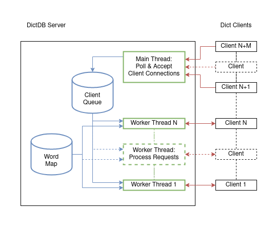

# DictDB

An in-memory word dictionary.

## Architecture



Components:

* **DictDB Server**: Responsible for storing the word database in memory and
  processing client requests to insert, search, or delete words.
  * **Client Queue**: Unbounded lock-free concurrent queue used to distribute
    accepted client sockets to worker threads.
  * **Word Map**: Unbounded concurrent hash map used to store words as keys with
    arbitrary values that are ignored.
* **Dict Client**: Responsible for translating command line arguments into
  requests for the server and displaying the responses to the end user.

Design notes:

* An authoritative process is likely useful here regardless of the communication
  method used between clients in order to initialize the empty word database
  and potentially do administrative tasks with it.
* Communicating between processes could be done over shared memory, Unix sockets,
  named pipes, or even TCP/IP sockets. Shared memory would be faster assuming an
  appropriate data structure can be created and managed inside the shared
  region but it does make administrative tasks (i.e. dynamically growing the
  allocated memory region) much more difficult. Unix sockets were used because
  they are the lowest overhead IPC mechanism available on Linux and macOS hosts
  (although named pipes could be used on Windows hosts too). Passing messages
  between the server and client processes provides a very neat boundary behind
  which much more complicated behavior can be hidden inside the server process.
* Handling multiple clients each issuing operations intended to run in parallel
  could be done multiple ways. Using asynchronous I/O and an event loop would
  likely be fastest but also require multiplexing onto threads in order to
  achieve concurrent execution. Using a pool of worker threads is a decent
  middle ground between an event loop and creating one worker thread per client.
  * An unbounded lock-free queue was used to store accepted client connections.
    No mechanism is currently implemented to limit how many clients can connect
    at one time but this could be easily done using one way counters and atomic
    operations between the main and worker threads without requiring additional
    locking.
  * Each worker thread retrieves the next available client connection and
    processes it's requests until the connection is closed. Effectively all the
    I/O and CPU bound work is done by the worker threads in this model to
    maximize parallelism. It also gives a slight edge to clients that issue
    several requests in a rapid sequential fashion which is likely a typical
    use case.
* The dictionary could be implemented with several data structures. A prefix
  tree is tempting given the problem constraint of only having to support
  English words but isn't especially useful for the insert, search, and delete
  operations needed. A hash map is more straight-forward to break into small
  segments for fine grained locking than a prefix tree.
* Starting the client process incurs overhead from parsing the command line
  arguments and opening the Unix domain socket. At that point it makes sense to
  issue multiple requests before quitting instead of always starting a separate
  client process per request. The client in this case supports running insert,
  search, and delete commands with multiple words which significantly improves
  performance. Additional speed could be achieved by adding a `--silent` flag
  to disable all console output by the client process.

## Requirements

* C++ Compiler w/ support for C++20
* Intel oneAPI TBB 2021.3.0+
* Python 3.8+

## Quick Start

On macOS with Homebrew:

```bash
brew install python3 tbb
```

On Arch Linux with Pacman:

```bash
pacman -Syu python tbb
```

## Quick Start

Use the included `waf` build system:

```bash
./waf configure
./waf build
```

After the build completes you should have the following binaries available:

* `build/pkg/dictdb/dictdb`
* `build/pkg/dict/dict`

Run the server process in the background:

```bash
export PATH=$PATH:$(pwd)/build/pkg/dictdb/
dictdb --help
dictdb &
```

Run the client to insert, search, and delete words:

```bash
export PATH=$PATH:$(pwd)/build/pkg/dict/
dict --help
dict insert foo
dict search foo
dict delete foo
```

The client also supports executing a command with a sequence of words:

```bash
dict insert one two three
dict search foo bar one two
dict delete foo one three
```

## Benchmark

Run the benchmarking script:

```bash
./benchmark.py --help
./benchmark.py -w 12 -c 12 -k 100 -i 1000000 -r 100000         
```

On macOS you may need to run the script by invoking it with the `python3`
binary or it will try to use the OS provided Python 2 interpreter instead.
Sample benchmark run for the command above on a 2x Intel Xeon E5-2643 w/
64GB of RAM machine:

```
>> Start server                                                                       
>> Generate initial words
>> Load initial words                                                                 
43.4766 seconds                                                                       
>> Generating test operations                                                         
>> Running benchmark                 
16.509 seconds                                                                        
>> Stop server
```

## References

Tools:

* [waf](https://waf.io/book/)

Libraries:

* [Intel oneAPI Threading Building Blocks](https://github.com/oneapi-src/oneTBB)
  * https://spec.oneapi.io/versions/latest/elements/oneTBB/source/nested-index.html

Articles:

* http://beej.us/guide/bgipc/html/single/bgipc.html
* https://momjian.us/main/blogs/pgblog/2012.html#June_6_2012
* https://attractivechaos.wordpress.com/2018/08/31/a-survey-of-argument-parsing-libraries-in-c-c/
* https://gcc.gnu.org/projects/cxx-status.html
* https://gcc.gnu.org/onlinedocs/gcc/Warning-Options.html
* https://gcc.gnu.org/onlinedocs/gcc/Optimize-Options.html
* https://stackoverflow.com/a/612476/937006
